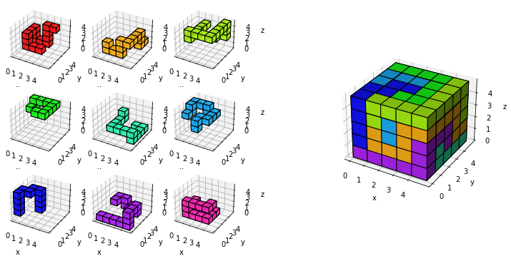

# A small solver for cube-assembly puzzels

This repository contains the `Piece` class, capable of representating block-based pieces and generating their orientations in 3D space.
Furthermore it contains the `Game` class, representing a cube-assembly puzzle based on the above-mentioned pieces.
The `Game` class has a solution routine for generating valid assemblies of pieces into a cube via a simple MILP, and representing the resulting solution.

## Usage

### First we initialize a game with some piece data


```python
from cubeSolver import Game
from example import pieces

game = Game(pieces, size=5)
game.plot_pieces()
```


    

    


### Each of the game's pieces has 24 possible orientations, given by 4 rotations about each of its 6 faces


```python
game.pieces[0].plot()
```


    

    


### Depending on their size each piece can further be positioned at different (x, y, z) offsets within the game


```python
game.piece_offsets
```


    [12, 6, 6, 16, 12, 12, 18, 6, 18]


### Considering all possible positions for each piece results in a large number of possibilities for positioning the different pieces within the game


```python
print(f"There are {game.num_possibilities(float)} (or {game.num_possibilities(str)}) "
      "different possibilities to position pieces")
```

    There are 5.111679989929967e+21 (or 5 111 679 989 929 966 829 568) different possibilities to position pieces


### Luckily we don't have to check all of them, instead we can simply consider the possible positions for each piece as binary variables in a MILP and formulate constraints limiting the nonzero variables per piece to 1 and ensuring each voxel of the game is filled at most once.


```python
game.num_binaries()
```


    2544


### In the back we use [Pyomo](http://www.pyomo.org/) for this, so you can use any MILP solver you have installed locally. If you don't have the specified solver installed on your system the `solve` routine will attempt to dispatch the solution to the [NEOS](https://neos-server.org/neos/solvers/index.html) server. Note that this will require you to enter your email address in the resulting prompt.


```python
results, solution = game.solve('gurobi')
```

    Academic license - for non-commercial use only - expires 2022-04-28
    Using license file /Users/marcolangiu/gurobi.lic


    

    


```python
print(solution)
```

    [[[7. 6. 6. 6. 6.]
      [8. 8. 8. 5. 6.]
      [0. 0. 0. 5. 5.]
      [8. 8. 0. 3. 5.]
      [0. 0. 0. 3. 3.]]
    
     [[7. 1. 1. 2. 2.]
      [8. 4. 8. 2. 6.]
      [0. 4. 7. 2. 6.]
      [8. 4. 7. 2. 5.]
      [0. 4. 4. 2. 3.]]
    
     [[7. 1. 5. 5. 2.]
      [8. 4. 8. 5. 3.]
      [0. 6. 6. 6. 6.]
      [8. 7. 7. 5. 5.]
      [0. 0. 0. 0. 3.]]
    
     [[7. 1. 1. 1. 2.]
      [8. 4. 8. 5. 3.]
      [8. 7. 8. 5. 3.]
      [8. 7. 2. 5. 3.]
      [4. 1. 2. 0. 3.]]
    
     [[7. 7. 7. 1. 2.]
      [4. 4. 7. 1. 2.]
      [4. 7. 7. 1. 2.]
      [4. 1. 1. 1. 2.]
      [4. 1. 2. 2. 2.]]]

